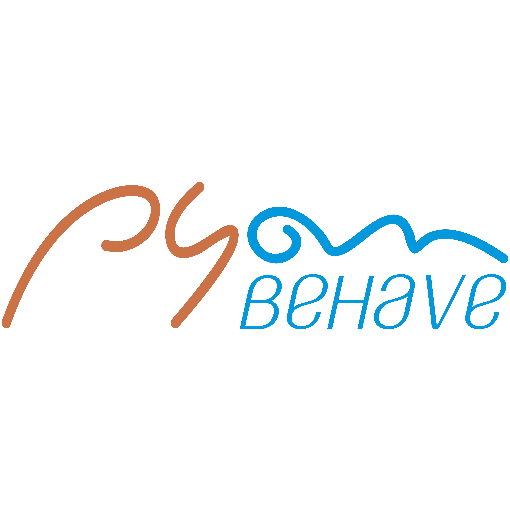

# pyon-behave-ui-tests-native-apps
PYON-BEHAVE | Appium-based UI Automated Testing Framework in Python-Behave for Native Apps

Pyon UI Test Automation project is available to implement UI tests for web and mobile applications with the following stacks and approaches:

- Programming Language: [Python-based](https://www.python.org/downloads/).
- Framework for behavioural tests: [Behave](https://behave.readthedocs.io/en/latest/)
- Minimal library requirements: [Appium Python Client](https://pypi.org/project/Appium-Python-Client/0.26/) and optionally: [Selenium](https://pypi.org/project/selenium/)

To know how you can configure your environment to implement and execute this project locally or even remotely, follow all the instructions from this documentation. So, let's get started and good luck!

## CLONING THE PROJECT FROM GITHUB

Go to [GITHUB](https://github.com/hudsonssrosa/pyon-behave-ui-tests-nativeapps) and **CLONE** the project using **GIT** (download and install GIT from [here](https://git-scm.com/downloads))

In you local machine, choose you local repository and clone the project using SSH for Mac OS or Linux platforms with this command:

```bash
    git clone git@github.com:hudsonssrosa/pyon-behave-ui-tests-nativeapps.git
```

If you are having issues when cloning or pushing to the repository make sure you have all your SSH keys in place. Click [here](https://help.github.com/en/github/authenticating-to-github/connecting-to-github-with-ssh) for more information about it.

## PREPARING YOUR ENVIRONMENT

### 1. Install Python

Download and install the [latest Python](https://www.python.org/downloads/) version (3.8 or over). Then, in any terminal, try this command to check if Python is correctly installed:

```bash
      python
```

### 2. Choose a good IDE

Once you have opened the project in an IDE of your preference (suggestion: install [Visual Studio Code](https://code.visualstudio.com/download) or [PyCharm CE](https://www.jetbrains.com/pycharm/)), then you will need to *set the Python interpreter* for the project.

After this, you are able to create the *Python Virtual Environment* for the PyonUIT project and install all the requirements needed (libraries/packages). You just need to run for the first time the `setup_python_env_update.py` and then the virtual environment as well the libraries in `requirements.txt` will be automatically installed for you.

- In Windows:

```bash
      python update.py
```

- In MacOSX or Linux:

```bash
      python3 update.py
```

Increment this command with CLI presented in next section 4.3, if you want to simulate the PyonUIT using Docker.

### 4. Ways to run this project

By default, the tests will run locally on APPIUM, but you have 3 ways to perform your execution.

#### 4.1 Run in debugging mode

To check if the environment is totally operational to begin with some implementation, or even check the existing tests, you might dealing with the environment variables to prepare for an execution. Thus, copy the file `env_settings.properties.local` and paste the new one in project's root (in the same place as the original file) renaming it to `env_settings.properties`. So, you can edit the properties freely, because this file is ignored by GIT versioning.

Into this file, to consider a development setting, ensure the property `development_mode` is set as `true`. With this, all the properties that start with `debug_...` will be considered in a project debugging overwriting any command lines from CLI:

```properties
    development_mode = true
    debug_flag_environment = staging

    debug_flag_target = local_emulation
    debug_flag_os = Android
    debug_flag_os_version = 11.0
    debug_flag_device_name = Samsung Galaxy A51
    debug_flag_mode = native_app
    debug_behave_tags = login-sample
    debug_behave_excluded_tags = wip
    debug_flag_orientation = Portrait
    debug_flag_language = en
    debug_flag_locale = en_GB
```

- To generate Allure Reports locally, make sure you have `Java` installed and the flag `generate_report = true` on your `env_settings.properties`.

#### 4.2 Run as if it were in CI

After any implementation into the PyonUIT, it is recommended to validate the tests simulating an execution capable to inject parameters in environment variables, like it is performed in a build from a CI server. To validate a test execution, keep in mind to run in a remote server such as BrowserStack or any other supported by PyonUIT in `fixtures.py`. Before this, you also will need to copy the file `run_behave.sh.local` and paste the new one in project's root (in the same place as the original file) renaming it to `run_behave.sh` to be ignored in commits.

Into this script file, you can set those environment variables, like this:

```bash
    PYON_ENVIRONMENT='staging'
    PYON_TARGET='local_emulation'
    PYON_MODE='native_app'

    PYON_OS='Android'
    PYON_OS_VERSION='11.0'
    PYON_DEVICE='Samsung Galaxy A51'

    PYON_ORIENTATION='Portrait'
    PYON_LANGUAGE='en'
    PYON_LOCALE='en_GB'
    PYON_APP_PATH='.resources/app_distribution/Sample.apk'

    PYON_TAGS=
    PYON_EXCLUDED_TAG='wip'
```

#### 4.3 Run via CLI (only command line)

You can handle all those parameters presented previously (in section 4.2) setting them directly via CLI. You just need to pass the desired values in the arguments by command line.
First of all, call the main runner file in the terminal and press Enter. So, try this:

```bash
      python3 behave_runner.py --help
```

You might see all the supported arguments that you can use:

```bash
usage: behave_runner.py [options]

optional arguments:
  -h, --help            show this help message and exit
  --environment {staging,dev,production}
                        ==> Environment to execute the tests (default = staging). Find the app URLs in properties file
  --target {remote_emulation,local_emulation,bs,real_device}
                        ==> Platform to execute the mobile tests (default = local_emulation): BS - BrowserStack
  --mode {native_app}   ==> Execution mode according the mobile platform (default = native_app)
  --os {iOS,Android,}   ==> Mobile Operational System
  --os_version {14.5,14.4,14.3,14.2,14.1,14.0,13.0,12.0,11.0,10.0,9.0,8.1,8.0,7.1,7.0,6.0,5.0,4.4,}
                        ==> Mobile platform versions
  --device_name {local,Google Pixel 4 XL,Google Pixel 4,Google Pixel 3a XL,Google Pixel 3a,Google Pixel 3 XL,Google Pixel 3,Google Pixel 2,Google Pixel,Google Nexus 6,Google Nexus 5,iPhone 12 Pro Max,iPhone 12 Pro,iPhone 12,iPhone 11 Pro Max,iPhone 11 Pro,iPhone 11,iPhone XS Max,iPhone XS,iPhone XR,iPhone X,iPhone 8 Plus,iPhone 8,iPhone 7 Plus,iPhone 7,iPhone 6S Plus,iPhone 6S,iPhone 6,iPhone SE 2020,iPhone SE,iPad,iPad Pro 12.9 2020,iPad Pro 12.9 2018,iPad Pro 11 2020,iPad Mini 2019,iPad Air 2019,iPad 7th,iPad Pro 11 2018,iPad Pro 9.7 2016,iPad Pro 12.9 2017,iPad Mini 4,iPad 6th,iPad 5th,Motorola Moto G7 Play,Motorola Moto X 2nd Gen,Motorola Moto X 2nd Gen,OnePlus 8,OnePlus 7,OnePlus 7T,OnePlus 6T,Samsung Galaxy S20,Samsung Galaxy S20 Plus,Samsung Galaxy S20 Ultra,Samsung Galaxy Note 20 Ultra,Samsung Galaxy Note 20,Samsung Galaxy Note 10 Plus,Samsung Galaxy Note 10,Samsung Galaxy Note 9,Samsung Galaxy Note 8,Samsung Galaxy Note 4,Samsung Galaxy A51,Samsung Galaxy A11,Samsung Galaxy A10,Samsung Galaxy S10e,Samsung Galaxy S10 Plus,Samsung Galaxy S10,Samsung Galaxy S9 Plus,Samsung Galaxy S9,Samsung Galaxy S8 Plus,Samsung Galaxy S8,Samsung Galaxy S7,Samsung Galaxy S6,Samsung Galaxy J7 Prime,Samsung Galaxy Tab S6,Samsung Galaxy Tab S5e,Samsung Galaxy Tab S4,Samsung Galaxy Tab S3,Samsung Galaxy Tab 4,Vivo Y50,Xiaomi Redmi Note 8,Xiaomi Redmi Note 7}
                        ==> The device name models (check the platform version supported in --os_version)
  --app_path APP_PATH   ==> Relative or absolute path of an .APK or .IPA file (format is automatically recognized if --os arg is set)
  --orientation {Landscape,Portrait}
                        ==> Screen orientation for mobile executions (default = Portrait)
  --language {,af,ar,be,bg,ca,cs,cy,da,de,el,en,eo,es,et,fr,ga,gl,gsw,hi,it,ja,nb,nl,pl,pt,ro,rof,ru,sv,tr,uk,zh,zu}
                        ==> Language to set for iOS (XCUITest driver only) and Android (default = )
  --locale {,af_,af_ZA,ar_,ar_001,ar_AE,ar_QA,ar_SA,be_,be_BY,bg_,bg_BG,ca_,ca_AD,ca_ES,ca_FR,ca_IT,cs_,cs_CZ,cy_,cy_GB,da_,da_DK,da_GL,de_,de_AT,de_BE,de_CH,de_DE,de_LI,de_LU,el_,el_CY,el_GR,en_,en_001,en_150,en_AU,en_BE,en_GB,en_HK,en_IE,en_IN,en_NZ,en_SG,en_US,en_ZA,eo_,es_,es_419,es_ES,et_,et_EE,fr_,fr_BE,fr_LU,ga_,ga_IE,gl_,gl_ES,gsw_,gsw_CH,gsw_LI,hi_,hi_IN,it_,it_CH,it_IT,ja_,ja_JP,nb_,nb_NO,nb_SJ,nl_,nl_NL,pl_,pl_PL,pt_,pt_AO,pt_BR,pt_CV,pt_GW,pt_MO,pt_MZ,pt_PT,pt_ST,pt_TL,ro_MD,ro_RO,rof_,ru_,ru_BY,ru_KG,ru_KZ,ru_MD,ru_RU,ru_UA,sv_,sv_AX,sv_FI,sv_SE,tr_,tr_CY,tr_TR,uk_,uk_UA,zh_,zh_CN,zh_HK,zh_MO,zh_SG,zu_,zu_ZA}
                        ==> Locale to set for iOS (XCUITest driver only) and Android. fr_CA format for iOS. CA format (country name abbreviation) for Android (default = )
  --tags TAGS           ==> Feature(s) / Scenario(s) to be executed (separate tags by comma and without spaces)
  --exclude {wip,skip,bug,slow,}
                        ==> Feature(s) / Scenario(s) to be ignored / skipped from execution using a single tag (recommended: wip)
```

Finally, you can vary the command options such as these samples below and much more. If you does not pass the other arguments, it will be considered the default values:

```bash
     python behave_runner.py --target local_emulation
     python behave_runner.py --target local_emulation --os iOS --os_version '14.3' --device_name 'iPhone 12' --orientation Landscape --app_path'.resources\\mobile_automation\\Sample.ipa'
     python behave_runner.py --target bs --mode native_app --os iOS --os_version '14.0' --device_name 'iPhone 11' --app_path '.resources\\mobile_automation\\Sample.ipa'
     python behave_runner.py --target real_device --mode native_app --os Android --os_version '10.0' --device_name 'Samsung Galaxy A51' --tags login-sample --exclude slow
```

## SETUP FOR NATIVE APPS RUNNING LOCALLY

### APPIUM CLIENT INSTALLATION

Install Appium Python Client in your local machine to make available the Appium web driver for mobile apps (emulated or real Android / iOS devices connected).
Then, just run this Python script to install the Appium Server (check if the version number is presented at the end):

```bash
    python appium_setup.py --server install
```

Open a separated terminal to start the Appium server. You have two ways to run it:

- Via `appium_setup.py` script, set the host and port if you need (by default it is "0.0.0.0" and "4723", respectively):

```bash
    python appium_setup.py --server start
```

```bash
    python appium_setup.py --server start --localhost <YOUR_HOST> --port <YOUR_PORT>
```

- Or you can execute directly with:

```bash
    appium --address <host> --port <number>
```

#### 1. Appium Desktop

To inspect the device elements in the Appium Client during test implementation, make sure if you have an Appium Desktop. You can download directly from [http://appium.io/](https://github.com/appium/appium-desktop/releases/tag/v1.18.2)
Additionally, you need to install Java to make available the Appium client [https://java.com/en/download](https://java.com/en/download/help/java_mac.html)

- Set the environment variable Path for JAVA_HOME:

```bash
    export JAVA_HOME=$(/usr/libexec/java_home)
```

- Use `$echo ANDROID_HOME` and `$echo JAVA_HOME` to get values from environment variables and set them in 'Edit Configurations' screen.
- If you want to do this more than once, use the script `appium_setup.py`.

### SETUP FOR LOCAL TESTS UPON iOS DEVICES RUNNING ON LOCAL MOBILE APP PROJECT

If you don't have any iPhone device with you, so you can use the XCode to emulate one. But first is necessary to clone the mobile application project to be tested with.

Follow these steps below (commands for MacOS / Linux) to setup the main resources such as Ruby:

- Install HomeBrew to facilitates the installation for any packages that Linux and MacOS are not able to do.

```bash
    /bin/bash -c “$(curl -fsSL https://raw.githubusercontent.com/Homebrew/install/master/install.sh)
```

#### 2. Installing Ruby using RVM

You can install Ruby in different ways. To prevent conflicts and protected Ruby folders, it's recommended to install it using RVM.

###### 2.1. Install GnuPG

```bash
    brew install gnupg
```

###### 2.2. Install GPG keys

```bash
    gpg --keyserver hkp://pool.sks-keyservers.net --recv-keys 409B6B1796C275462A1703113804BB82D39DC0E3 7D2BAF1CF37B13E2069D6956105BD0E739499BDB
```

###### 2.3. Install RVM

```bash
	\curl -sSL https://get.rvm.io | bash -s stable
```

###### 2.4. You should receive a thank you 🙏 message in the console

```bash
    echo "source $HOME/.rvm/scripts/rvm" >> ~/.bash_profile
```

###### 2.5. Quit all terminal and open it again

```bash
    rvm list
```

###### 2.6. You should get this message

```bash
	# No rvm rubies installed yet. Try 'rvm help install'.
```

###### 2.7. Install some ruby version

Try a version such as 2.7.1:

```bash
    rvm install 2.7.1
```

###### 2.8. After installation

Check which ruby version available and if is properly installed:

```bash
    rvm list
```

###### 2.9. Create default ruby version

```bash
    rvm alias create default 2.7.1
```

###### 2.10. If installation and configuration were successful

RVM should now load whenever you open a new shell. This can be tested by executing the following command which should output rvm is a function as shown below.

```bash
    type rvm | head -n 1
```

###### 2.11. To change the Ruby version

Just check the versions available:

```bash
    rvm list known
```

###### 2.12. Switching between RVM versions

Then, you can switch to your desired version:

```bash
    rvm install 2.6.3
    rvm use 2.6.3
    rvm use system
    rvm alias create default 2.6.3
    ruby -v
```

#### 3. Installing Ruby - Conventional Way

Install Ruby RBenv using **brew** and set it to version 2.6.5:

```bash
    brew install ruby
    brew install rbenv
    rbenv init
    rbenv rehash
    rbenv install 2.6.5
    rbenv global 2.6.5
    eval "$(rbenv init -)"
    ruby -v
    curl -fsSL https://github.com/rbenv/rbenv-installer/raw/master/bin/rbenv-doctor | bash
```

- Export the Ruby Path (check the version first) if is not possible to run `ruby -v`, for example:
  
```bash
    export PATH="/usr/local/opt/ruby/bin:/usr/local/lib/ruby/gems/3.0.0/bin:$PATH"
    echo 'export PATH="/usr/local/opt/ruby/bin:$PATH"' >> ~/.bash_profile
    source ~/.bash_profile
```

- Install Rails to manage the server-side application:
  
```bash
    gem install rails
```

#### 4. Installing XCode to Manage and Simulate Apps Locally

Download and install the XCode from [Mac App Store](https://developer.apple.com/downloads). Just make sure that your `XCode.app` is located at "/Applications" folder, otherwise you would see an error such as:

`An unknown server-side error occurred while processing the command. Original error: Could not determine iOS SDK version: Could not get Xcode version. /Library/Developer/Info.plist does not exist on disk.`

If you continue facing this issue, perhaps you will need to set the correct path from where the Xcode.app is being executed. For example, run this command to find the location:

```bash
    xcrun --sdk macosx --show-sdk-path
```

To switch the SDK reference for Xcode, use this command:

```bash
    xcode-select --switch /Applications/
```

##### 4.1. Dependencies - Installing Ruby Gems

Now, with a mobile app source in a local repository, try to open it using XCode and execute the following commands at the terminal to install the Ruby Gems (dependencies):

```bash
    gem install bundler
    bundle install
```

##### 4.2. Building and Opening the App

Install Carthage to help you in managing dependencies of dependencies in a Cocoa application. Finally, try to open the project via command line:

```bash
    brew install carthage
    brew update && brew upgrade carthage
    open <YOUR_APP_NAME>.xcworkspace
```

##### 4.3. Updating Dependencies for Application Project Builded Locally

If you need to update the dependencies before build any App project cloned into your local machine, it's very important to execute some commands to prevent build errors and clean cached files.

- Clear any cached generated by older project builds:

```bash
    rm -rf ~/Library/Developer/Xcode/DerivedData/
```

- So first open a terminal, and navigate to the App repository. Then update dependencies to Pod:

```bash
    cd /Users/<your_pc_user_name>/<path_to_repo>/<local_app_project>
    bundle exec pod install
```

To see more information about, please, use or check the script `setup_local_ios_project.py`.

#### 5. Emulating App in the XCode Simulator

Now you are able to emulate any App using XCode Simulator. Just keep in mind these steps:

- Select the SCHEME in the XCode Simulator
- Use the shortkey 'CMD + R' to emulate the app in a device chosen
- At XCode Project Navigator view, select the app in folder where it was build". Then, copy the Full Path presented in File Inspector. This will be useful to set the `mobile_app_path` property into the `env_settings.properties` later.

#### 6. Installing FastLane to Simulate using FastFile in CI

If you need to execute the tests externally in a CI Server like Bitrise, you will need to install Fastlane to run it locally and evaluate the FastFile script. So, first install Fastlane using the command below to prevent permission to writeblocks during the installation

```bash
    sudo gem install fastlane -n /usr/local/bin
    fastlane -v
```

##### 5.1. Run the FastFile

Once installed Fastlane, you can run FastFile locally by this command:

```bash
    fastlane ios pyon_ui_tests 
```

If you are facing errors during Fastlane executiong, try to check the log and if you have `rspec` missed, just try to install this Gem with:

```bash
    gem install rspec --user
```

### SETUP FOR LOCAL ANDROID DEVICES

You will need at least the Android Debug Bridge (ADB) to help with test case implementations and debug the app.
So follow these steps below:

- Install HomeBrew:

```bash
    /bin/bash -c "$(curl -fsSL https://raw.githubusercontent.com/Homebrew/install/master/install.sh)"
```

- Install ADB:

```bash
    brew cask install android-platform-tools
```

- Export the environment variable Path:

```bash
    export ANDROID_HOME="Users/<PC_USER_NAME>/Library/Android/sdk
    export PATH="${PATH}:/$ANDROID_HOME/platform-tools:/$ANDROID_HOME/tools:/$ANDROID_HOME/tools/bin"
```

- Start using `adb`.

## BDD APROACHING USING PYTHON-BEHAVE

The [Behaviour Driven Development](https://cucumber.io/docs/bdd/) can make our automated tests much more agile, productive, sustainable and with a living-documentation of business. Considering this, in the following sections will be presented a step-by-step about how to implement a simple scenario considering Python-Behave (library backed up by Python code - Cucumber-based) and Selenium to make possible to automate our Gherkin scenarios.

### HOW TO IMPLEMENT TESTS USING PYONUIT FRAMEWORK?

Considering that the number of tests can increase significantly in this project, it is very important to keep in mind that you also need to have a good and coherent organisation of files, scenarios, features and settings associated to the tests. Initially, to have the codes recognised by Behave framework, all the files related to test cases should be implemented into the `features` folder. Take a look at the recommended structure below.

#### 1. Gherkin Files

All the tests are documented in [Gherkin](https://behave.readthedocs.io/en/latest/tutorial.html#feature-files), a structured and natural language with properly keywords (Given, When, Then) that allows us to write testable specifications. Those files have the format `.feature` and should be organised into the '/features' with subfolders such as ENVIRONMENT FOLDER (dev/staging/production) > DOMAIN FOLDER (global name of a functionality) > FEATURE FILE. For example:

```
    features
    └─── feature_domains
        └─── staging
            │   automation_sample_login.feature
            |   ...
            production
            └─── ...
```

##### 1.1. Create a Feature

With this, you could create a simple scenario that validates if user can search a content in the app. You just need to use the keywords with `Feature:`, `Background:`, `Scenario:`, and describe the behaviours for steps with `Given`, `When` and `Then`:

```gherkin
    @login-sample
    Feature: Automation Sample App

        Scenario: Login the user with its credentials
            Given that app is open at Login page
            When user provides their wrong credentials
            Then user sees "Wrong username or password"
```

As you could see, add a **tag** (started with @) trying to choose an easy and intuitive name that reminds you about the Feature. Also, you can include another tag above the scenario, if you want to create new scenarios into the same file. This can make easier to call specific scenarios or an entire feature to be executed via Behave command line.

##### 1.2. Generate the Step definitions

After having a scenario defined, make sure that `development_mode` is `false` in `env_settings.properties` if you want to execute the `python3 behave_runner.py --tags login-sample` in the terminal (or set `development_mode` to `true` and include the tag `app-login` to property `debug_behave_tags`). Then, copy the snippet definitions generated automatically in console. You will need to implement your steps using them, like these:

```bash
        You can implement step definitions for undefined steps with these snippets:

        @given(u'that app is open at Login page')
        def step_impl(context):
            raise NotImplementedError(u'STEP: Given that app is open at Login page')


        @when(u'user provides their wrong credentials')
        def step_impl(context):
            raise NotImplementedError(u'STEP: When user provides their wrong credentials')


        @then(u'user sees "Wrong username or password"')
        def step_impl(context):
            raise NotImplementedError(u'STEP: Then user sees "Wrong username or password"')
```

##### 1.3. Create a Step skeleton

Copied the snippets, create a new Python file into the '/features/steps' folder with the same or similar name of your `.feature`.
Try to increment the file name ending with `*_steps.py` and place them in the `steps` folder only (to be read by Behave framework).

```
    features
    └─── steps
        |   app_login_steps.py
            ...
```

Into this new Python file, you should import `behave` library to take the advantages of Behave to your [Step Implementation](https://behave.readthedocs.io/en/latest/tutorial.html#python-step-implementations).

```python
from behave import *

    # Paste your snippets for steps...
```

Then, just paste your snippets from clipboard into the `search_car_steps.py`.

```python
from behave import *


@given(u'that app is open at Login page')
def step_impl(context):
    raise NotImplementedError(u'STEP: Given that app is open at Login page')


@when(u'user provides their wrong credentials')
def step_impl(context):
    raise NotImplementedError(u'STEP: When user provides their wrong credentials')


@then(u'user sees "{error}"')
def step_impl(context):
    raise NotImplementedError(u'STEP: Then user sees "Wrong username or password"')
```

##### 1.4. Page Object Pattern

Now, you have a basic structure using Behave, but the Steps have no code with the significant actions to cover the behaviour expected in the descriptions. To make this possible, all the interactions with HTML pages might be implemented using Appium/Selenium web driver, coded in Python. So, it is recommended a design pattern such as [Page Objects](https://martinfowler.com/bliki/PageObject.html) to manage, reuse and store all the locators extracted from a functionality in mobile screen.

Additionally, considering that you will have many app pages to interact in your scenarios, it is very important to let them organised, distiguished by folders and subfolders as well.

In this case, create a file names ending with `*_page.py` and put them into a folder containing the APP NAME (or a macro app module) > FUNCTIONALITY NAME (or feature name) > PYTHON PAGE OBJECT, like this sample:

```
    features
    └─── pages
        └─── app_sample
            │   auth_page.py
            │   home_page.py
                ...
```

At the '/features/pages/' folder, create a new page object class that inherits the BaseAppPage module (`from driver_wrappers.appium.native_app_wrapper import BaseAppPage`):

```python
from driver_wrappers.appium.native_app_wrapper import BaseAppPage
from appium.webdriver.common.mobileby import MobileBy as MBy


class HomePage(BaseAppPage):
    # ... declare the locators and Appium methods here
```

Through BaseAppPage, you can take all advantages from default Selenium web driver (to click, type text, etc.) and also consume dozen of wrapped methods customised from the most common component actions identified in an application (get text from an element, select a dropdown option, swipe and many other actions):

```python
    self.wait_for_element(by, location, with_text, title, is_visible, is_not_visible, is_clickable, is_selected, is_frame, is_alert, is_presented, typing_secs, handle_timeout)

    self.get_element_by(by_type, element_location)

    self.get_element_text(by_type, element_location, is_visible)

    self.type_text(input_text, by_type, element_location, is_clickable)

    self.click_on(by_type, element_location, is_visible)

    self.click_on_element_by_accessibility_id(element_location)

    # ... and many others
```

Considering this, extract the element locators inspecting the application's page opened in Appium Desktop and place them into the variables of your Page Object class. But, you will need to import `from appium.webdriver.common.mobileby import MobileBy` into the HomePage, to define a kind of locator for a XCUITest element should be able to interpret (MBy.XPATH, MBy.ACCESSIBILITY_ID, By.IOS_UIAUTOMATION, etc.):

```python
from driver_wrappers.appium.native_app_wrapper import BaseAppPage
from appium.webdriver.common.mobileby import MobileBy as MBy


class AuthPage(BaseAppPage):
    loc_lbl_title = (MBy.XPATH, '//android.widget.FrameLayout[1]/android.view.ViewGroup/android.widget.TextView')
    loc_txt_username = (MBy.ID, 'com.dgotlieb.automationsample:id/userName')
    loc_txt_password = (MBy.ID, 'com.dgotlieb.automationsample:id/userPassword')
    loc_btn_login = (MBy.ID, 'com.dgotlieb.automationsample:id/loginButton')
    loc_lbl_error_message = (MBy.ID, 'com.dgotlieb.automationsample:id/errorTV')
```

The locator declared with a tuple (`(MBy.<TYPE>, "<location string>")`) can be called directly using asterisk before a `self.loc_name`.

###### 1.4.a) Assertions

To create validation methods for the steps when is necessary (mainly in the `@Then` step), you should use the existing assert methods already invoked by _BaseAppPage_. So, you are able to call them directly into the page used by a scenario. Just define the asserts like these:

- `self.assert_that("<FOUND STRING IN PAGE>").is_equals_to("<EXPECTED STRING>", "<OPTIONAL DESCRIPTION>")`
- `self.assert_that("<FOUND STRING IN PAGE>").contains_the("<EXPECTED STRING>", "<OPTIONAL DESCRIPTION>")`
- `self.assert_that("<FOUND STRING IN PAGE>").is_different_from("<EXPECTED STRING>", "<OPTIONAL DESCRIPTION>")`
- `self.assert_that(<FOUND NUMBER IN PAGE>).is_greater_than(b_value=<NUMBER>, "<OPTIONAL DESCRIPTION>")`
- `self.assert_that(<FOUND NUMBER IN PAGE>).is_less_than(b_value=<NUMBER>, "<OPTIONAL DESCRIPTION>")`
- `self.assert_that(<FOUND NUMBER IN PAGE>).is_between_the(expected_min=<NUMBER>, expected_max=<NUMBER>, "<OPTIONAL DESCRIPTION>")`
- `self.assert_that().is_in_pdf("<PDF FILE PATH OR URL>", "<EXPECTED STRING>", "<OPTIONAL DESCRIPTION>")`

Then, you should have a page with an implementation like that:

```python
class AuthPage(BaseAppPage):
    loc_lbl_title = (MBy.XPATH, '//android.widget.FrameLayout[1]/android.view.ViewGroup/android.widget.TextView')
    loc_txt_username = (MBy.ID, 'com.dgotlieb.automationsample:id/userName')
    loc_txt_password = (MBy.ID, 'com.dgotlieb.automationsample:id/userPassword')
    loc_btn_login = (MBy.ID, 'com.dgotlieb.automationsample:id/loginButton')
    loc_lbl_error_message = (MBy.ID, 'com.dgotlieb.automationsample:id/errorTV')

    def check_title(self):
        self.is_the_element_presented(*self.loc_lbl_title)
        
    def type_input_username(self, input_value):
        self.wait_for_element(*self.loc_txt_username)
        # self.click_on(*self.loc_txt_username)
        self.type_text(input_value, *self.loc_txt_username)

    def type_input_password(self, input_value):
        self.wait_for_element(*self.loc_txt_password)
        self.type_text(input_value, *self.loc_txt_password)

    def click_on_login(self):
        self.click_on(*self.loc_btn_login)

    def validate_error_message(self, message):
        message_found = self.get_element_text(*self.loc_lbl_error_message)
        self.assert_that(message_found).contains_the(value_expected=message, optional_description="Login validation message")
```

##### 1.5. Step Implementation

Having all the pages needed already implemented, you need to call the methods to satisfy the scenario behaviour, as well the validations.

```python
from behave import *
from features.pages.app_sample.auth_page import AuthPage


login_page = AuthPage(object)


@given('that app is open at Login page')
def step_given_that_app_is_open_at_login_page(context):
    login_page.check_title()


@when('user provides their wrong credentials')
def step_when_user_types_text_to_search(context):
    login_page.type_input_username("wrong_user_name")
    login_page.type_input_password("wrong_pass_123")


@then('user sees "{error}"')
def step_then_the_content_related_is_found(context, error):
    login_page.validate_error_message(message=error)
```

And your first test case scenario is ready to be executed for the first time!

## SELECT THE SCENARIOS TO BE EXECUTED

Regardless if you are using the debug mode to execute tests or triggering them via CI server, you should set the tags accordingly declaring with or without `@`, but separating them by comma and without spaces. See these examples:

You can combine TAGS like these examples:

- e.g. 1) ISOLATED SCENARIO: `demo-app-login`

- e.g. 2) COMBINING SCENARIOS: `demo-app-login,demo-app-search,...`

- e.g. 3) CALLING ENTIRE FEATURES: `login-sample`

If you leave the parameter related to tags empty, all the features from the environment selected will be executed regardless if is set by properties or by command line.

## FURTHER INFORMATION ABOUT CI/CD FILES

If you need to manage or maintain the CI/CD files for PyonUIT, just keep in mind about the following structure.

- JENKINS (Both: iOS and Android): Create all files for environment provisioning, considering the fixtures implemented. Then, create scripts or reuse the existing ones following the steps showed previously in this document. Finally, call the tests in the same way as `run_behave.sh` file.
- BITRISE (iOS only): Create a Workflow in the Bitrise, integrating the necessary build steps. You need to consider the `.fastlane/Fastfile` as a last Workflow step into the Workflow configuration. If you need to install Fastlane, follow the README.md in the same folder `.fastlane/Fastfile`.
